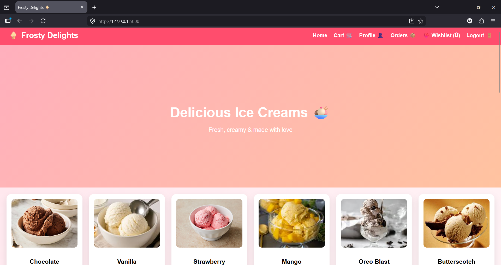
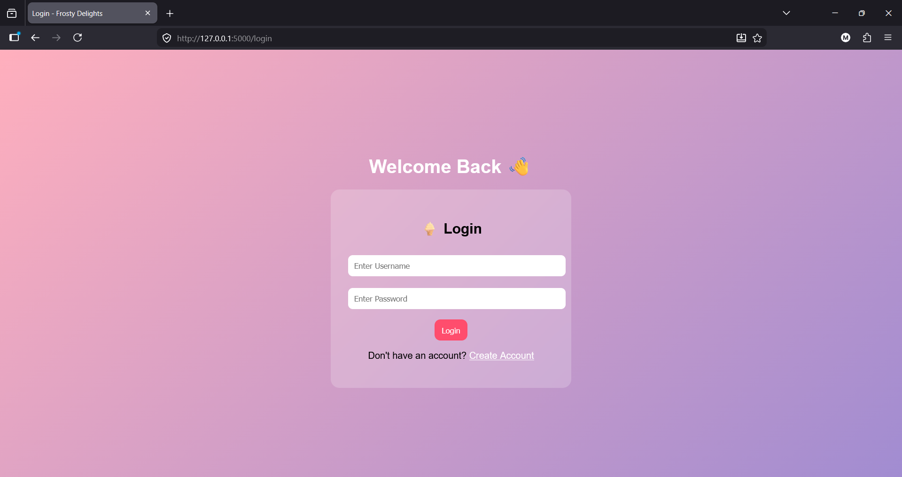
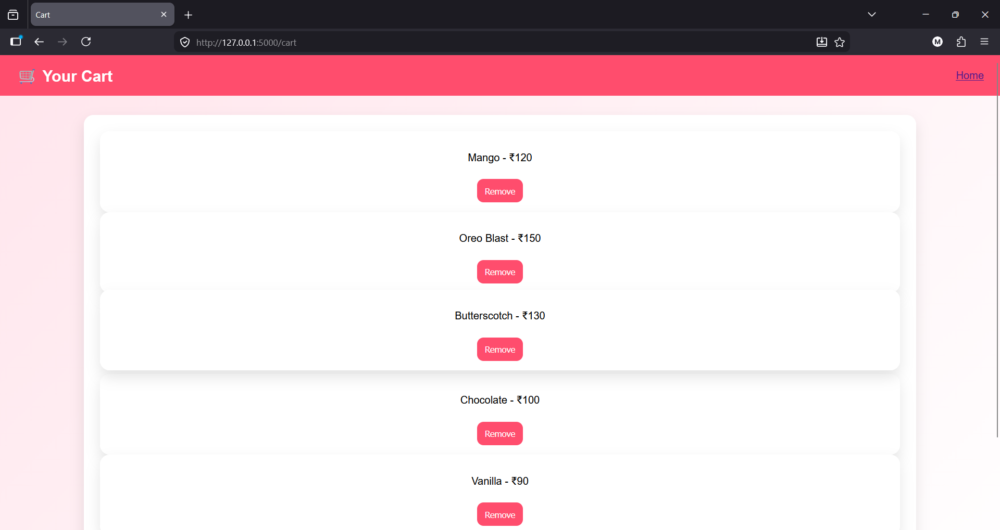
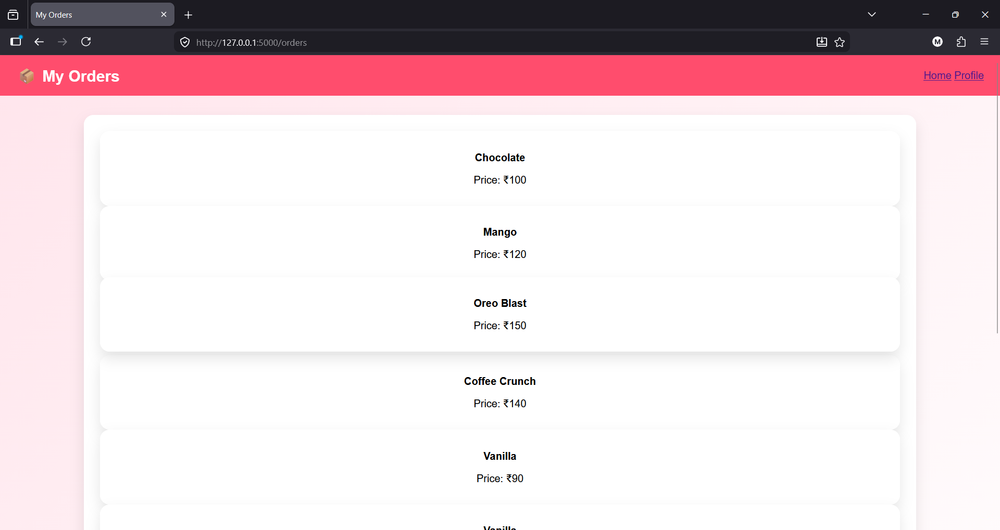
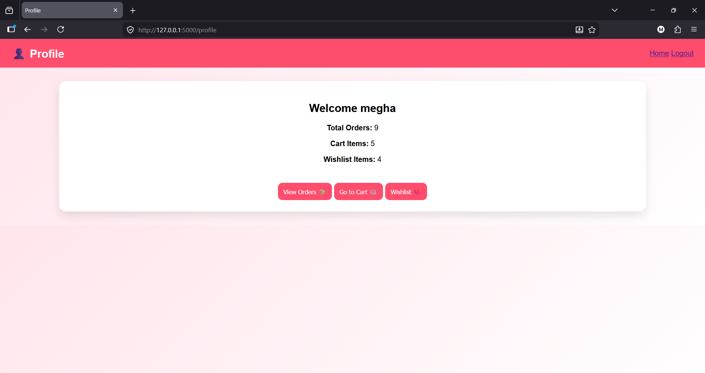
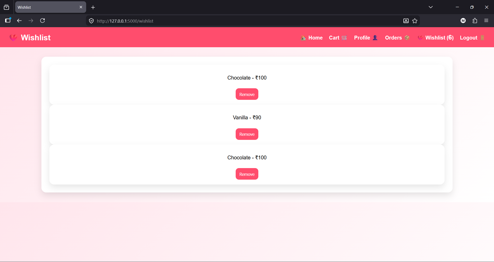

# ecommerce-website
A full-stack e-commerce web application built using Python Flask and SQLite with user authentication, cart, wishlist, order management and review system.

## Features

* User Signup & Login Authentication
* Shopping Cart Functionality
* Wishlist Management
* Order Placement & Order History
* Product Review & Rating System
* User Profile Dashboard
* Responsive UI Design

## Technologies Used

* Python
* Flask
* SQLite
* HTML
* CSS
* JavaScript

## Project Structure

ecommerce-website/
│
├── static/
│   ├── images/
│   ├── style.css
│   └── script.js
│
├── templates/
│   ├── index.html
│   ├── login.html
│   ├── signup.html
│   ├── cart.html
│   ├── wishlist.html
│   ├── checkout.html
│   ├── orders.html
│   └── profile.html
│
├── app.py
├── database.db
└── README.md

## Installation

1. Clone the repository

git clone https://github.com/Megha-Dhami/ecommerce-website.git

2. Navigate to the project folder

cd ecommerce-website

3. Install dependencies

pip install flask

4. Run the application

python app.py

5. Open in browser

http://127.0.0.1:5000

## Future Improvements

* Payment Gateway Integration
* Admin Dashboard
* Product Search & Filter
* Online Deployment
* Better Security Features

## Screenshots

### Home Page

### Login Page

### Cart Page

### Orders Page

### Profile Page

### Wishlist Page

## Author

Megha Dhami
